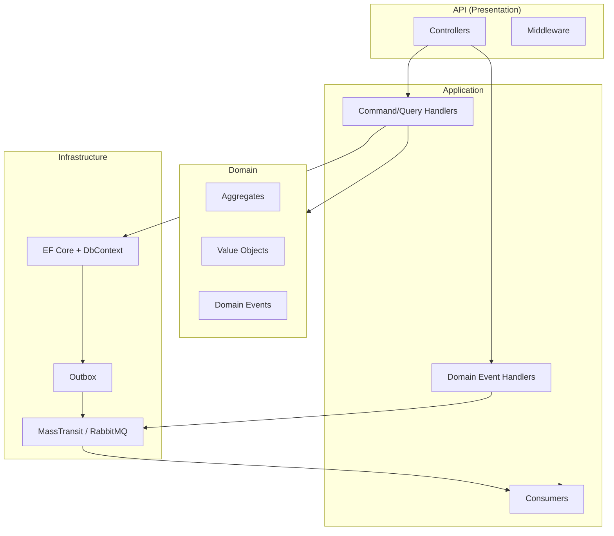
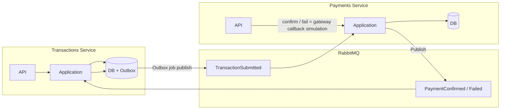

# Architecture — Event-Driven Platform

Short overview: **Clean Architecture** per service, **event-driven** cross-service, with **reliability** (outbox, correlation, observability).

---

## Clean Architecture (per service)



- **Domain:** no references to other projects; aggregates, value objects, domain events.
- **Application:** use cases (MediatR), handlers, consumers; references Domain and messaging contracts only.
- **Infrastructure:** persistence (EF Core, SQL Server), message broker (MassTransit/RabbitMQ), outbox.
- **API:** HTTP endpoints, middleware (CorrelationId, logging, exception handling).

---

## Cross-service event flow

**Flow:** Submit transaction → event → Payments **starts payment** (creates payment intent). In production the user would be sent to a payment gateway; **Confirm** and **Fail** are **simulations of the gateway callback** (success / failure).



---

## Event reliability

| Mechanism | Where | Purpose |
|-----------|--------|---------|
| **Outbox** | Transactions | Domain events written in same DB transaction as aggregate; background job publishes to RabbitMQ. Events not lost on failure. |
| **CorrelationId** | HTTP → Outbox → Events → Consumer | Same ID on request, outbox message, and integration event; consumer pushes to log context. Trace full path in Loki. |
| **Idempotent cancel** | Transaction.Cancel() | No-op if already Cancelled. |
| **State guards** | All aggregates | Submit/Confirm/Fail/Complete/Cancel only from allowed states. |

---

## Observability

- **CorrelationId** on HTTP (middleware), stored in outbox, passed in integration events, set in consumer log context.
- **Structured logging** (Serilog) with properties; **Loki** (labels: level, RequestId, CorrelationId, SourceContext).
- **Health checks** for API and dependencies (DB, broker as needed).
- **OpenAPI** for both services.

---

## Repo layout (conceptual)

```
src/
  Services/
    Transactions/     # Transactions service
      Transaction.Domain/
      Transactions.Application/
      Transactions.Infrastructure/
      Transactions.API/
    Payments/        # Payments service
      Payments.Domain/
      Payments.Application/
      Payments.Infrastructure/
      Payments.API/
  BuildingBlocks/    # Shared: abstractions, messaging contracts, correlation
```
