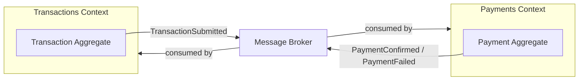
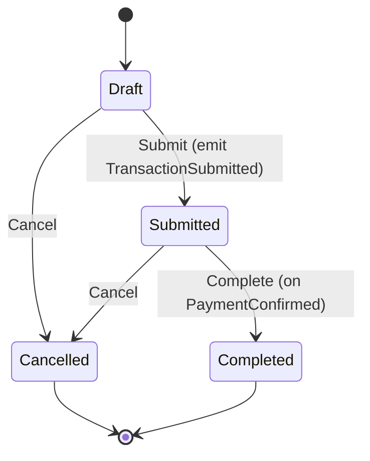
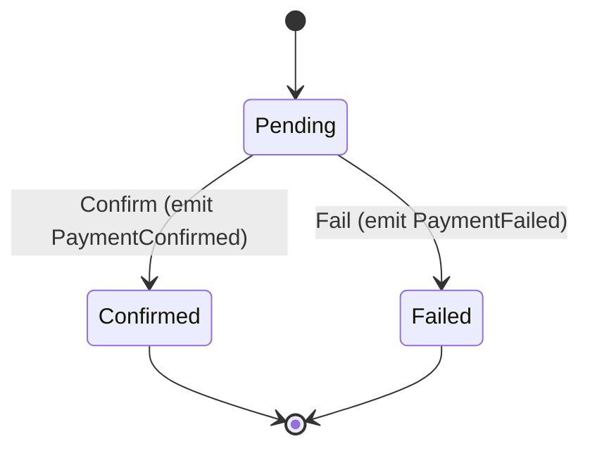
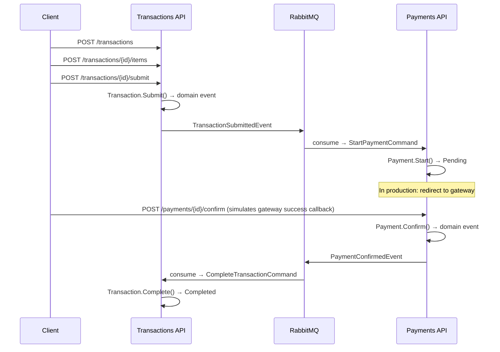

# Domain Model — Event-Driven Financial Transactions

Two **bounded contexts**: **Transactions** and **Payments**. They communicate only via **integration events** over the message broker.

---

## Bounded contexts (high level)

---

## A) Transactions context

**Aggregate:** `Transaction` (root) + `TransactionItem` (entity).

| Invariant | Rule |
|----------|------|
| Submit | Only **Draft**; must have **≥1 items**. |
| Cancel | Not allowed if **Completed**; **idempotent** if already Cancelled. |
| Complete | Only from **Submitted** (after payment confirmed). |

**State machine:**

**Domain events (in-process):** `TransactionSubmitDomainEvent`.  
**Integration event (to broker):** `TransactionSubmittedEvent(TransactionId, Currency, Amount, CorrelationId)`.

---

## B) Payments context

**Aggregate:** `Payment` (root only).

| Invariant | Rule |
|----------|------|
| Start | Valid `TransactionId` and `Amount > 0`. |
| Confirm | Only from **Pending**. |
| Fail | Only from **Pending**; requires **reason**. |

**State machine:**

**Domain events (in-process):** `PaymentConfirmedDomainEvent`, `PaymentFailedDomainEvent`.  
**Integration events (to broker):** `PaymentConfirmedEvent`, `FailedPaymentEvent` (with `CorrelationId` for tracing).

---

## Event flow (cross-context)

**Flow:** Create transaction → Add items → Submit → **Payment starts automatically** (event) → (in production: user goes to payment gateway) → **Confirm / Fail** = simulation of gateway callback (success / failure).

- **Confirm** and **Fail** endpoints simulate the **payment gateway callback** (success vs failure). In production these would be called by the real gateway (e.g. webhook or redirect).

---

## Design decisions (short)

- **One aggregate per context** for this scope: clear boundaries and simple consistency.
- **Value objects:** `TransactionId`, `PaymentId`, `Money`, `Currency` to keep the model explicit and type-safe.
- **Integration events** carry only IDs and needed data (no internal entities); **CorrelationId** for end-to-end tracing.
- **Cancel** is explicit and idempotent; **Completed** is only set when Payments confirms, keeping payment as source of truth for “paid”.
